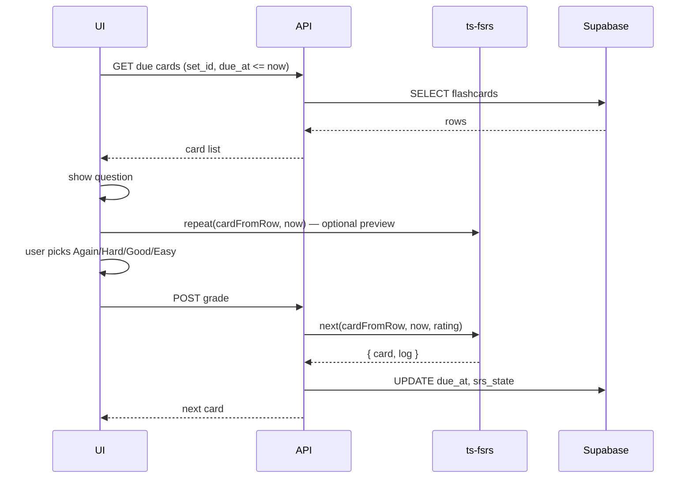

# ts-fsrs — dokumentacja (Context7)

> Pobrano: **2026-05-27**  
> Źródło: [Context7](https://context7.com) — biblioteka `/open-spaced-repetition/ts-fsrs` (Benchmark 80.67, High reputation, 41 snippetów) + uzupełnienie typów z [models.ts](https://github.com/open-spaced-repetition/ts-fsrs/blob/main/packages/fsrs/src/models.ts)  
> Oficjalna dokumentacja API: https://open-spaced-repetition.github.io/ts-fsrs/

## Czym jest ts-fsrs

TypeScriptowa implementacja algorytmu **FSRS** (Free Spaced Repetition Scheduler). Zastępuje klasyczny SM-2; planuje kolejne powtórki na podstawie oceny odpowiedzi użytkownika (Again / Hard / Good / Easy).

**Repozytorium:** https://github.com/open-spaced-repetition/ts-fsrs

## Instalacja

```bash
npm install ts-fsrs
```

Importy (pakiet główny):

```typescript
import { createEmptyCard, fsrs, Rating, State, generatorParameters } from "ts-fsrs";
```

## Szybki start — typowy przepływ sesji

```typescript
import { createEmptyCard, fsrs, Rating } from "ts-fsrs";

const scheduler = fsrs();
const card = createEmptyCard();

// Podgląd wszystkich 4 wyników PRZED odpowiedzią użytkownika (UI: przyciski Again/Hard/Good/Easy).
const preview = scheduler.repeat(card, new Date());

// Po wyborze oceny — zastosuj jedną ocenę i pobierz nowy stan + log.
const result = scheduler.next(card, new Date(), Rating.Good);

console.log(preview[Rating.Good].card);
console.log(result.card);
console.log(result.log);
```

| Metoda | Kiedy używać |
|--------|----------------|
| `repeat(card, now)` | Podgląd wszystkich 4 ścieżek bez mutacji karty (idealne pod UI sesji) |
| `next(card, now, grade)` | Po wyborze oceny — jedna ścieżka, zwraca `{ card, log }` |

## Enums

### `Rating` (ocena odpowiedzi)

```typescript
Rating.Manual = 0;
Rating.Again = 1;
Rating.Hard = 2;
Rating.Good = 3;
Rating.Easy = 4;
```

W sesji powtórkowej używamy **Again, Hard, Good, Easy** (bez Manual).

### `State` (stan karty)

```typescript
State.New = 0;
State.Learning = 1;
State.Review = 2;
State.Relearning = 3;
```

## Typ `Card` — pola do persystencji

```typescript
interface Card {
  due: Date;              // data następnej powtórki
  stability: number;      // stabilność pamięci
  difficulty: number;     // trudność karty
  elapsed_days: number;   // @deprecated — usunięte w v6.0.0
  scheduled_days: number; // zaplanowany odstęp (dni)
  learning_steps: number; // krok w fazie (re)learning
  reps: number;           // liczba powtórek
  lapses: number;         // liczba pomyłek / lapsów
  state: State;           // New | Learning | Review | Relearning
  last_review?: Date;     // ostatnia powtórka (opcjonalne)
}
```

### `ReviewLog` (po każdej ocenie)

```typescript
interface ReviewLog {
  rating: Rating;
  state: State;
  due: Date;
  stability: number;
  difficulty: number;
  elapsed_days: number;       // @deprecated v6.0.0
  last_elapsed_days: number;  // @deprecated v6.0.0
  scheduled_days: number;
  learning_steps: number;
  review: Date;               // moment tej powtórki
}
```

`next()` zwraca `RecordLogItem = { card: Card; log: ReviewLog }`.

## Inicjalizacja schedulera

### Domyślne parametry

```typescript
const scheduler = fsrs();
```

### Własne parametry

```typescript
const scheduler = fsrs({
  request_retention: 0.9,      // docelowa retencja (obciążenie vs. jakość)
  maximum_interval: 36500,       // max odstęp w dniach
  enable_fuzz: true,             // losowa zmiana długich interwałów
  enable_short_term: true,       // kroki learning/relearning
  learning_steps: ["1m", "10m"],
  relearning_steps: ["10m"],
});
```

### Serializacja parametrów (np. konfiguracja konta)

```typescript
import { fsrs, generatorParameters } from "ts-fsrs";

const params = generatorParameters({
  request_retention: 0.9,
  maximum_interval: 36500,
});

const scheduler = fsrs(params);
// JSON.stringify(params) — do zapisu w DB / config
```

## API schedulera (`IFSRS`)

| Metoda | Opis |
|--------|------|
| `repeat(card, now)` | `IPreview` — mapa wyników dla Again/Hard/Good/Easy bez zmiany karty |
| `next(card, now, grade)` | Jedna ocena → `{ card, log }` |
| `next(card, now, grade, afterHandler)` | Jak `next`, z transformacją wyniku (np. Date → timestamp) |
| `get_retrievability(card, now?, format?)` | Prawdopodobieństwo przypomnienia (string lub number) |
| `next_state(memoryState, elapsedDays, grade)` | Niskopoziomowo: następny stan pamięci (symulacje) |
| `next_interval(stability, elapsedDays)` | Niskopoziomowo: następny interwał w dniach |
| `rollback(card, log)` | Cofnięcie ostatniej operacji |
| `forget(card, now, reset_count?)` | „Zapomnij” kartę |
| `reschedule(card, reviews, options?)` | Przebudowa stanu z historii logów |

**Uwaga:** Do standardowej sesji wystarczą `repeat` + `next`. `next_state` / `next_interval` — analityka, symulacje, własne pipeline'y.

## `createEmptyCard`

```typescript
const card = createEmptyCard(new Date());

// Opcjonalny handler — np. dodanie custom id lub serializacja dat
const card = createEmptyCard(new Date(), (card) => ({
  ...card,
  due: card.due.getTime(),
  last_review: card.last_review?.getTime() ?? null,
}));
```

Nowa fiszka w aplikacji: `createEmptyCard()` + zapis do DB (patrz mapowanie poniżej).

## Serializacja dat pod Supabase / JSON

Karty używają `Date`. W Workerze i przy zapisie JSONB warto normalizować:

```typescript
const saved = scheduler.next(card, new Date(), Rating.Good, ({ card, log }) => ({
  card: {
    ...card,
    due: card.due.getTime(),
    last_review: card.last_review?.getTime() ?? null,
  },
  log: {
    ...log,
    due: log.due.getTime(),
    review: log.review.getTime(),
  },
}));
```

Przy odczycie z DB: odwrotna konwersja (`new Date(due_at)`, pola w `srs_state` jako liczby/ISO).

## Mapowanie na schemat 10xCards (F-01)

Istniejący kontrakt (z `data-schema-rls` + `src/types.ts`):

| Kolumna DB | Rola |
|------------|------|
| `due_at` `timestamptz` | **`Card.due`** — indeks `(set_id, due_at)` do zapytań „karty do powtórki” |
| `srs_state` `jsonb` | Reszta stanu FSRS (opaque JSON) |

**Zapytanie sesji:** `due_at <= now()` dla kart w zestawie użytkownika (RLS przez `flashcard_sets`).

### Proponowany kształt `srs_state`

Przechowuj pełny stan FSRS poza `due` (duplikat `due` w JSON jest OK na odczyt bez joinów, ale **źródłem prawdy dla sortowania** pozostaje `due_at`):

```json
{
  "stability": 0,
  "difficulty": 0,
  "scheduled_days": 0,
  "learning_steps": 0,
  "reps": 0,
  "lapses": 0,
  "state": 0,
  "last_review": null
}
```

`state` jako liczba (`State` enum). Po `next()`:

1. Zaktualizuj `due_at` ← `result.card.due` (ISO UTC).
2. Zapisz pozostałe pola z `result.card` do `srs_state`.
3. Opcjonalnie: osobna tabela `review_logs` z `result.log` (poza MVP — roadmap wymaga tylko auto-harmonogramu).

**Nowa fiszka (S-01/S-03):** `due_at = now()`, `srs_state = {}` lub stan po `createEmptyCard()` — obie strategie są zgodne z F-01; przy pierwszej sesji zmapuj `{}` → `createEmptyCard()`.

### Różnica względem roadmapy SM-2

Roadmap wspomina `interval`, `ease_factor` — to model **SM-2**. **FSRS nie używa `ease_factor`**; zamiast tego `stability`, `difficulty`, `scheduled_days`. Schemat F-01 (`srs_state` JSONB) jest poprawny bez migracji SM-2.

## Przepływ UI sesji S-04 (szkic)



## Parametry `FSRSParameters` (pełna lista)

| Pole | Typ | Znaczenie |
|------|-----|-----------|
| `request_retention` | `number` | Docelowa retencja (np. 0.9) |
| `maximum_interval` | `number` | Maks. odstęp w dniach |
| `w` | `number[]` | Wagi modelu (domyślnie z generatora) |
| `enable_fuzz` | `boolean` | Fuzz długich interwałów |
| `enable_short_term` | `boolean` | Gdy `false`, kroki learning/relearning wyłączone |
| `learning_steps` | `Steps` | np. `['1m', '10m']` |
| `relearning_steps` | `Steps` | np. `['10m']` |

## Historia i import (poza MVP, warto znać)

- **`rollback(card, log)`** — cofnięcie ostatniego review.
- **`forget(card, now, reset_count?)`** — reset / zapomnienie.
- **`reschedule(card, reviews, options?)`** — odtworzenie stanu z listy logów (import z Anki itp.).

## Linki

- GitHub README: https://github.com/open-spaced-repetition/ts-fsrs/blob/main/README.md
- Pakiet `fsrs` README: https://github.com/open-spaced-repetition/ts-fsrs/blob/main/packages/fsrs/README.md
- Dokumentacja API (Context7 alt. ID): `/websites/open-spaced-repetition_github_io_ts-fsrs`
- Algorytm FSRS: https://github.com/open-spaced-repetition/fsrs4anki/wiki

## Decyzja dla `/10x-plan srs-review-session`

| Temat | Rekomendacja |
|-------|----------------|
| Biblioteka | **ts-fsrs** (`/open-spaced-repetition/ts-fsrs`) |
| Persystencja | `due_at` + `srs_state` (bez migracji SM-2) |
| API sesji | `repeat` (podgląd) + `next` (zapis po ocenie) |
| Zależność npm | `npm install ts-fsrs` (jeszcze nie w `package.json`) |
